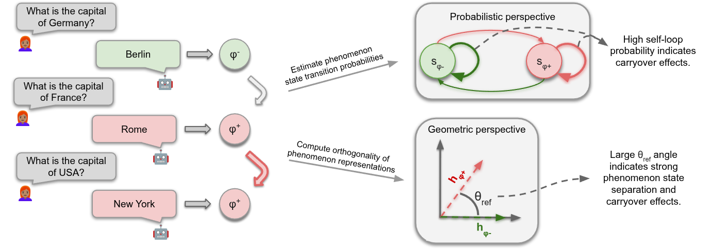

# Old Habits Die Hard: How Conversational History Geometrically Traps LLMs

## Overview

This repository contains the code for the paper "Old Habits Die Hard: How Conversational History Geometrically Traps
LLMs".
The paper investigates how conversational history influences the behavior of LLMs, both externally (probabilistic
perspective) and internally (geometric perspective).

****

## Table of Contents

- [Abstract](#abstract)
- [Setup Instructions](#setup-instructions)
- [Usage](#usage)
- [Citation](#citation)
- [Repository Structure](#repository-structure)

## Abstract

How does the conversational past of large language models (LLMs) influence their future performance?
Recent work suggests that LLMs are affected by their conversational history in unexpected ways.
For instance, hallucinations in prior interactions may influence subsequent model responses.
In this work, we introduce History Echoes, a framework that investigates how conversational history biases subsequent
generations.
The framework explores this bias from two perspectives: probabilistically, we model conversations as Markov chains to
quantify state consistency; geometrically, we measure the consistency of consecutive hidden representations.
Across three model families and six datasets spanning diverse phenomena, our analysis reveals a strong correlation
between the two perspectives.
By bridging these perspectives, we demonstrate that behavioral persistence manifests as a geometric trap, where gaps in
the latent space confine the model's trajectory.

## Setup Instructions

1. Clone the repository:

```bash
git clone https://github.com/technion-cs-nlp/HistoryEchoes.git
cd HistoryEchoes
```

2. Create and activate the conda environment:

```bash
conda env create -f environment.yml
conda activate history_echoes
```

## Usage

The codebase consists of two main components:

1. **`History_data_creation.py`**:  Create the conversational history datasets from raw QA.
2. **`analysis.py`**: An analysis that create the results from the paper.

### Data generation

To create conversational history datasets, run the following command:

```bash
python History_data_creation.py \
    --model_name "meta-llama/Llama-3.1-8B-Instruct" \
    --dataset_name "triviaqa" \
    --num_conv 100 \
    --conv_length 20 \
    --ordered
```

Parameters:

- `--model_name`: The name of the LLM model to use.
- `--dataset_name`: The name of the dataset to create conversational history from. (Options: triviaqa,
  natural_questions, sorry, do_not_answer, sycophancy, sycophancy_negative)
- `--num_conv`: Number of conversations to generate.
- `--conv_length`: Length of each conversation.
- `--ordered`: Whether to maintain the order of questions in the conversation.
- `--temp`: Temperature setting for the model's response generation. In the paper we used 0.0- greedy decoding.
- `--two_topics`: Whether to create conversations with two distinct topics.
- `--two_topics_4_1`: Whether to create conversations with a 4:1 ratio of questions from two topics.

The results will be saved in the `results/` directory.

To run sycophancy, please first download the data titled answer.jsonl from https://github.com/meg-tong/sycophancy-eval.

### Analysis

To analyze the results and generate plots as shown in the paper, run:

```bash
python analysis.py 
```

The plots will be saved in the `plots/` directory.

## Citation

If you use History Echoes in your research, please cite our paper:

```bibtex
@article{simhi2026old,
  title={Old Habits Die Hard: How Conversational History Geometrically Traps LLMs},
  author={Simhi, Adi and Barez, Fazl and Tutek, Martin and Belinkov, Yonatan and Cohen, Shay B},
  journal={arXiv preprint arXiv:2603.03308},
  year={2026}
}
```

## Repository Structure

```
HistoryEchoes/
├── plots/                    # Benchmark datasets
├── results/                  # Evaluation results
├── Analysis.py               # Run analysis and generate plots
├── History_data_creation.py  # Create conversational history datasets
├── environment.yml           # Conda environment specification
└── README.md                 # This file
```

